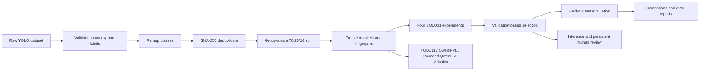

# VisionGuard

Reproducible computer-vision system for detecting and reviewing PPE and workplace-safety violations. The project covers dataset auditing, leakage-resistant splitting, YOLO11 training, four controlled experiments, independent test evaluation, a unified YOLO11/Qwen3-VL ablation pipeline, and a persistent human review platform.

> Current status: portfolio/research prototype, not a certified safety system. A negative prediction does not prove that a scene is safe.

## Result at a glance

> Round-2 evidence status: dataset facts and review-platform capabilities are verified from source
> artifacts and negative tests. The YOLO values below are historical project claims marked
> `implemented_unverified` because the checkpoints and training/evaluation JSON/CSV artifacts are
> absent. The resume VLM F1=0.600 claim is `unsupported`. See
> [`docs/RESUME_EVIDENCE.md`](docs/RESUME_EVIDENCE.md) and run `make evidence-gate`.

The selected checkpoint is **YOLO11s, 512 px, best epoch 40**. It was selected by validation mAP@50–95, then evaluated once on the held-out test split.

| Model | Validation mAP@50–95 | Test mAP@50–95 | Test mAP@50 | Mean latency* |
| --- | ---: | ---: | ---: | ---: |
| YOLO11n · 512 · 30 epochs | 0.4452 | 0.4312 | 0.6188 | 8.33 ms |
| YOLO11n · 640 · 30 epochs | 0.4618 | — | — | 9.06 ms |
| YOLO11s · 512 · 30 epochs | 0.4739 | — | — | 12.29 ms |
| **YOLO11s · 512 · 50-epoch schedule** | **0.4923** | **0.4602** | **0.6615** | 23.61 ms |

\* Batch 1 on Apple Silicon MPS; 5 warm-up images and 100 measured test images. Runs were recorded at different times, so latency is descriptive rather than a controlled hardware claim.

These values cannot currently be independently recomputed from the checkout. Do not cite them as
verified until the source-artifact gate passes.

## Implementation and evidence status

| Capability | Code implemented | Verified here | Needs real weights/data |
| --- | --- | --- | --- |
| Dataset validation, class remap, SHA-256 deduplication, source-group split, frozen fingerprint and leakage audit | Yes | Recomputed source artifacts + negative tests | Upstream source needed for a fresh rebuild |
| Four YOLO11 experiment configurations, evaluation, benchmark and reporting | Yes | Code/tests only; numeric claims unverified | Checkpoints, four training CSVs, test and benchmark JSON |
| YOLO11, Qwen3-VL and YOLO-grounded Qwen3-VL adapters | Yes | Fixture pipeline plus one real Qwen-only diagnostic | Project YOLO checkpoint and grounded-Qwen run |
| IoU-grounded precision/recall/F1, unsupported-finding and negative-scene hallucination metrics | Yes | Record-level recomputation, tamper test, fixture, and real Qwen diagnostic | Independently adjudicated real ablation set |
| Persistent sample review queue, bbox/label add/update/delete, accept/reject/correct, JSON/CSV audit export | Yes | Store and HTTP interaction tests | YOLO checkpoint to populate via live inference |

**Fixture results are synthetic control-flow checks. They are not real model results and must not be described as a completed VLM ablation experiment.** Qwen3-VL weights, caches, images, and the full dataset are not bundled.

One real Qwen3-VL 2B diagnostic was executed on 36 recovered historical Dev records with mixed
reviewer provenance. A resumed evidence pass had 34 cache hits and retained two strict JSON parse
failures. Record-level recomputation at IoU 0.5 produced precision 0.1786, recall 0.2778, and F1
**0.2174**. This is evidence about one diagnostic arm—not evidence that the three-model ablation was
completed, and not support for the resume's F1=0.600 statement. See
`docs/evidence/qwen_real_historical_result.json` and
`docs/evidence/QWEN_DIAGNOSTIC_FAILURES.md`.

Round 2 independently recomputed 8,762 images, 43,727 annotations, seven classes, zero
cross-split SHA-256 groups, zero cross-split source groups, and dataset SHA-256
`6d40b6e5d09cc4e1ed3a6d8d9a8a88259f1e18dc9f117d664fa5694473db3bb2`.
The machine-readable source is `docs/source-verification.json`; README text alone is not evidence.

## Local inference and review platform

The local platform has no additional web-framework dependency. It loads the YOLO checkpoint once, accepts an image or short video, draws detections, then enqueues the original sample and predictions for human review. Reviewers can accept, reject, or correct box coordinates/classes; state persists in SQLite and exports as versioned JSON or CSV.

```bash
make setup
make demo \
  EXPERIMENT=exp4_yolo11s_512_e50 \
  IMGSZ=512
```

Open [http://127.0.0.1:7860](http://127.0.0.1:7860), then upload a JPG, PNG, MP4, MOV, or WebM file. Or run the entry point directly:

```bash
.venv/bin/python scripts/run_demo.py \
  --model outputs/experiments/exp4_yolo11s_512_e50/weights/best.pt \
  --device auto --imgsz 512
```

Model weights and generated demo sessions are intentionally Git-ignored. Put your checkpoint at the path above or pass `--model /path/to/best.pt`.

Review state defaults to `outputs/demo/reviews.sqlite3`. Override it with
`--review-database /durable/path/reviews.sqlite3`. Reviewers can edit person boxes, explicitly
confirm violation classes, mark dirty/excluded samples with reasons, and accept, reject, or correct
each record. Test-split queue responses omit ground truth. Evaluation JSONL contains only reviewed,
protocol-valid, non-dirty, non-excluded records and is written with fsync plus atomic replace. The
underlying routes include `GET /api/reviews`, `GET /api/reviews/{id}`,
`PATCH /api/reviews/{id}`, `GET /api/reviews/export.{json,csv}`, and
`GET /api/reviews/evaluation.jsonl`.

Desktop 1280×720 and mobile 390×844 visual checks found no horizontal overflow, aligned image and
bbox overlays, and a one-column mobile decision area; browser console warnings/errors were zero.
The check used a clearly labeled local fixture queue, not a model run. Measurements are recorded in
`docs/evidence/review_visual_qa.json`.

## System design



Important engineering choices:

- The source dataset is never modified in place.
- Exact duplicates are removed by SHA-256; Roboflow variants are grouped before splitting.
- Every training/evaluation run verifies a frozen dataset fingerprint.
- Checkpoint selection uses validation metrics, never test metrics.
- Evaluation and error analysis default to batch 1 on MPS to avoid shared-memory OOM failures.
- Demo video totals are detection events across frames, not unique tracked people.

## Dataset

The prepared dataset contains **8,762 images**, **43,727 annotations**, and seven classes: `person`, `helmet`, `vest`, `gloves`, `boots`, `no_helmet`, and `no_vest`.

| Split | Images | Annotations |
| --- | ---: | ---: |
| Train | 6,125 | 30,656 |
| Validation | 1,753 | 8,747 |
| Test | 884 | 4,324 |

The upstream Roboflow export identifies the source as Construction PPE v3 under CC BY 4.0. Dataset files are not committed; see [DATASET_CARD.md](DATASET_CARD.md) for attribution, processing, leakage controls, and known risks.

## Reproduce the pipeline

Python 3.12 is recommended for the recorded Apple Silicon environment.

```bash
python3.12 -m venv .venv
source .venv/bin/activate
python -m pip install --upgrade pip
python -m pip install -r requirements.txt
python -m pip install --no-deps -e .
make check
```

Core commands:

```bash
# Inspect Python, PyTorch, Ultralytics, and MPS/CPU selection
make environment

# Validate and preview an Ultralytics dataset
make validate DATA=/path/to/data.yaml
make visualize DATA=/path/to/data.yaml

# Non-destructive class cleanup, deduplication, grouping, split, and freeze
make remap DATA=training/datasets/safety/data.yaml
make finalize DATA=training/datasets/safety_clean/data.yaml

# Train one configured experiment
make train MODEL=yolo11s.pt EPOCHS=50 IMGSZ=512 EXPERIMENT=exp4_yolo11s_512_e50

# Evaluate, benchmark, inspect errors, and generate reports
make evaluate benchmark errors report \
  EXPERIMENT=exp4_yolo11s_512_e50 IMGSZ=512
make comparison

# Evidence audit; strict mode fails while required YOLO artifacts are absent.
make evidence
make evidence-gate
make evidence-ledger

# Fixture-only VLM pipeline verification (never model-quality evidence)
make vlm-fixture
```

Generated artifacts include JSON/CSV/Markdown metrics, confusion matrices, prediction samples, latency summaries, review candidates, and an interactive HTML comparison report.

### Run a real VLM ablation

The VLM adapters load optional dependencies only for real runs, so the existing YOLO environment remains usable. Install versions compatible with the selected pinned model revision:

```bash
python -m pip install transformers accelerate
cp configs/vlm_ablation.real.example.yaml configs/vlm_ablation.real.yaml
# Edit absolute manifest/model paths and replace REPLACE_WITH_PINNED_COMMIT.
python scripts/evaluate_vlm.py \
  --config configs/vlm_ablation.real.yaml \
  --output outputs/vlm/real_evaluation.json
```

The direct Qwen adapter follows the official model card's `AutoModelForMultimodalLM` and `AutoProcessor` interface. The example revision remains a deliberate placeholder so a real run cannot accidentally claim an unpinned model.

The recovered historical Dev labels can be used for an explicitly limited Qwen-only diagnostic:

```bash
make vlm-real-historical
```

This uses an atomic per-example cache, preserves raw outputs and failures, and promotes a compact
record-level evidence report. The recorded real Qwen-only result is F1 0.2174 over 36 records, with
34 cache hits and two strict JSON parse failures on the resumed evidence pass. The labels mix named
human, Codex-assisted, and missing reviewer provenance, so the result cannot verify the resume F1.
A full three-model ablation remains blocked without the selected project YOLO checkpoint and a
grounded-Qwen run.

The manifest is JSONL with one adjudicated target per image:

```json
{"id":"image-001","image":"/data/image-001.jpg","target":{"findings":[{"person_box":[0.1,0.1,0.5,0.9],"violation":"no_helmet"}]}}
```

Use predicted YOLO boxes for the grounded inference condition. Do not substitute ground-truth boxes at inference. The evaluator labels every run `fixture` or `real` and writes `contains_real_model_results` / `contains_fixture_results` at report level. See `schemas/vlm_finding.schema.json`, `schemas/vlm_evaluation_result.schema.json`, and `schemas/review_export.schema.json`.

## Repository map

```text
demo/static/                 local inference and review UI
configs/                     experiment and data examples
scripts/                     CLI entry points
src/visionguard/             dataset, training, evaluation, reporting, demo logic
tests/                       unit and regression tests
DATASET_CARD.md              data provenance and limitations
MODEL_CARD.md                selected model evidence and intended use
schemas/                     VLM and review artifact contracts
docs/VLM_EXTENSION_GUIDE.md  implemented VLM pipeline and remaining research work
```

## What this project does—and does not—claim

This repository demonstrates an end-to-end ML workflow and a working inference surface. It does not establish production readiness: each configuration has only one seed; minority-class test coverage is small; source grouping relies on filename-derived proxies; and no domain-shift, calibration, adversarial, privacy, or human-factors study has been completed. See [MODEL_CARD.md](MODEL_CARD.md) before interpreting outputs.

The VLM software and fixture verification are implemented, but a defensible real-model study still requires pinned weights, an independently adjudicated evaluation set, suitable compute, repeated runs, and human evidence review. See [VLM implementation and execution guide](docs/VLM_EXTENSION_GUIDE.md).

## License

Code is released under the [MIT License](LICENSE). Dataset and model artifacts retain their own upstream terms; the dataset is not bundled with the code.
