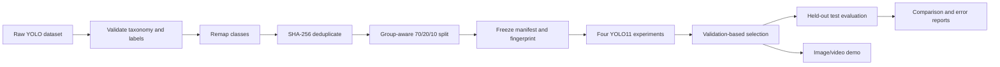

# VisionGuard

Reproducible computer-vision system for detecting PPE and workplace-safety violations in images and video. The project covers dataset auditing, leakage-resistant splitting, YOLO11 training, four controlled experiments, independent test evaluation, latency benchmarking, error analysis, and a local inference demo.

> Current status: portfolio/research prototype, not a certified safety system. A negative prediction does not prove that a scene is safe.

## Result at a glance

The selected checkpoint is **YOLO11s, 512 px, best epoch 40**. It was selected by validation mAP@50–95, then evaluated once on the held-out test split.

| Model | Validation mAP@50–95 | Test mAP@50–95 | Test mAP@50 | Mean latency* |
| --- | ---: | ---: | ---: | ---: |
| YOLO11n · 512 · 30 epochs | 0.4452 | 0.4312 | 0.6188 | 8.33 ms |
| YOLO11n · 640 · 30 epochs | 0.4618 | — | — | 9.06 ms |
| YOLO11s · 512 · 30 epochs | 0.4739 | — | — | 12.29 ms |
| **YOLO11s · 512 · 50-epoch schedule** | **0.4923** | **0.4602** | **0.6615** | 23.61 ms |

\* Batch 1 on Apple Silicon MPS; 5 warm-up images and 100 measured test images. Runs were recorded at different times, so latency is descriptive rather than a controlled hardware claim.

The final model improves test mAP@50–95 by **+0.0289 absolute** over the baseline. The minority violations remain the bottleneck: test AP@50–95 is 0.1392 for `no_helmet` and 0.2197 for `no_vest`.

## Local image/video demo

The demo has no additional web-framework dependency. It loads the final checkpoint once, accepts an image or short video, draws detections, summarizes violation events, and exports a JSON report.

```bash
make setup
make demo \
  EXPERIMENT=exp4_yolo11s_512_e50 \
  IMGSZ=512
```

Open [http://127.0.0.1:7860](http://127.0.0.1:7860), then upload a JPG, PNG, MP4, MOV, or WebM file. Or run the entry point directly:

```bash
.venv/bin/python scripts/run_demo.py \
  --model outputs/experiments/exp4_yolo11s_512_e50/weights/best.pt \
  --device auto --imgsz 512
```

Model weights and generated demo sessions are intentionally Git-ignored. Put your checkpoint at the path above or pass `--model /path/to/best.pt`.

## System design



Important engineering choices:

- The source dataset is never modified in place.
- Exact duplicates are removed by SHA-256; Roboflow variants are grouped before splitting.
- Every training/evaluation run verifies a frozen dataset fingerprint.
- Checkpoint selection uses validation metrics, never test metrics.
- Evaluation and error analysis default to batch 1 on MPS to avoid shared-memory OOM failures.
- Demo video totals are detection events across frames, not unique tracked people.

## Dataset

The prepared dataset contains **8,762 images**, **43,727 annotations**, and seven classes: `person`, `helmet`, `vest`, `gloves`, `boots`, `no_helmet`, and `no_vest`.

| Split | Images | Annotations |
| --- | ---: | ---: |
| Train | 6,125 | 30,656 |
| Validation | 1,753 | 8,747 |
| Test | 884 | 4,324 |

The upstream Roboflow export identifies the source as Construction PPE v3 under CC BY 4.0. Dataset files are not committed; see [DATASET_CARD.md](DATASET_CARD.md) for attribution, processing, leakage controls, and known risks.

## Reproduce the pipeline

Python 3.12 is recommended for the recorded Apple Silicon environment.

```bash
python3.12 -m venv .venv
source .venv/bin/activate
python -m pip install --upgrade pip
python -m pip install -r requirements.txt
python -m pip install --no-deps -e .
make check
```

Core commands:

```bash
# Inspect Python, PyTorch, Ultralytics, and MPS/CPU selection
make environment

# Validate and preview an Ultralytics dataset
make validate DATA=/path/to/data.yaml
make visualize DATA=/path/to/data.yaml

# Non-destructive class cleanup, deduplication, grouping, split, and freeze
make remap DATA=training/datasets/safety/data.yaml
make finalize DATA=training/datasets/safety_clean/data.yaml

# Train one configured experiment
make train MODEL=yolo11s.pt EPOCHS=50 IMGSZ=512 EXPERIMENT=exp4_yolo11s_512_e50

# Evaluate, benchmark, inspect errors, and generate reports
make evaluate benchmark errors report \
  EXPERIMENT=exp4_yolo11s_512_e50 IMGSZ=512
make comparison
```

Generated artifacts include JSON/CSV/Markdown metrics, confusion matrices, prediction samples, latency summaries, review candidates, and an interactive HTML comparison report.

## Repository map

```text
demo/static/                 local inference UI
configs/                     experiment and data examples
scripts/                     CLI entry points
src/visionguard/             dataset, training, evaluation, reporting, demo logic
tests/                       unit and regression tests
vlm/                         grounded-VLM data, baselines, evaluation, LoRA entry point
DATASET_CARD.md              data provenance and limitations
MODEL_CARD.md                selected model evidence and intended use
docs/VLM_EXTENSION_GUIDE.md  multimodal experiment design guide
```

## Experimental grounded-VLM extension

The `feature/vlm-grounding` work adds a strict safety-inspection JSON schema, manually reviewed gold-data workflow, YOLO-only / VLM-only / YOLO-grounded ablations, hallucination and grounding metrics, and a guarded CUDA LoRA entry point. The grounded prompt exposes only `person`, `helmet`, and `vest` detections—not the target violation labels.

```bash
make vlm-install
make vlm-validate
make vlm-candidates

# One-record system smoke tests; not reportable performance metrics
make vlm-baseline VLM_SPLIT=train VLM_MODE=yolo VLM_LIMIT=1
make vlm-evaluate VLM_SPLIT=train VLM_MODE=yolo
```

See [`vlm/README.md`](vlm/README.md) for the data-adjudication contract, Qwen3-VL baseline commands, evaluation methodology, and CUDA LoRA gate. Dev/test gold sets must be populated by manual review before any multimodal accuracy claim is made.

## What this project does—and does not—claim

This repository demonstrates an end-to-end ML workflow and a working inference surface. It does not establish production readiness: each configuration has only one seed; minority-class test coverage is small; source grouping relies on filename-derived proxies; and no domain-shift, calibration, adversarial, privacy, or human-factors study has been completed. See [MODEL_CARD.md](MODEL_CARD.md) before interpreting outputs.

The multimodal extension is experimental and currently contains one reviewed training record and three reviewed development records; the test manifest remains empty and uninspected. Its [smoke-test results](vlm/SMOKE_RESULTS.md) verify the pipeline but are not evidence of generalization. The full annotation and experiment plan remains in the [VLM extension guide](docs/VLM_EXTENSION_GUIDE.md).

## License

Code is released under the [MIT License](LICENSE). Dataset and model artifacts retain their own upstream terms; the dataset is not bundled with the code.
